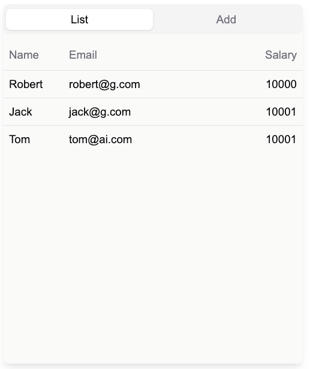
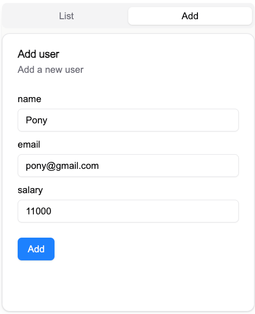

## nextjs demo app with drizzle-orm, postgresql, shadcn-ui. Install the docker and you can run the project.

### build docker and run
* build docker image
```shell
docker build -t demo_app:v1 -f docker/Dockerfile .
```
* run
```shell
docker compose -f docker/docker-compose.yml up
```
* visit http://localhost:3000


* list tab



* add tab


